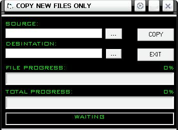



## Copy Only New Files in a Folder

### Description

This progrqam will scan through a drive or a folder and all subdirectories and only copy file that were created on the current day. This program was developed to backup all new data.
 
### More Info
 

             |
---                |---
**Submitted On**   |2004-12-08 14:15:22
**By**             |[ElitePCBOX](https://github.com/Planet-Source-Code/PSCIndex/blob/master/ByAuthor/elitepcbox.md)
**Level**          |Intermediate
**User Rating**    |4.4 (22 globes from 5 users)
**Compatibility**  |VB 6\.0
**Category**       |[Files/ File Controls/ Input/ Output](https://github.com/Planet-Source-Code/PSCIndex/blob/master/ByCategory/files-file-controls-input-output__1-3.md)
**World**          |[Visual Basic](https://github.com/Planet-Source-Code/PSCIndex/blob/master/ByWorld/visual-basic.md)
**Archive File**   |[Copy\_Only\_1826971282004\.zip](https://github.com/Planet-Source-Code/elitepcbox-copy-only-new-files-in-a-folder__1-57611/archive/master.zip)

